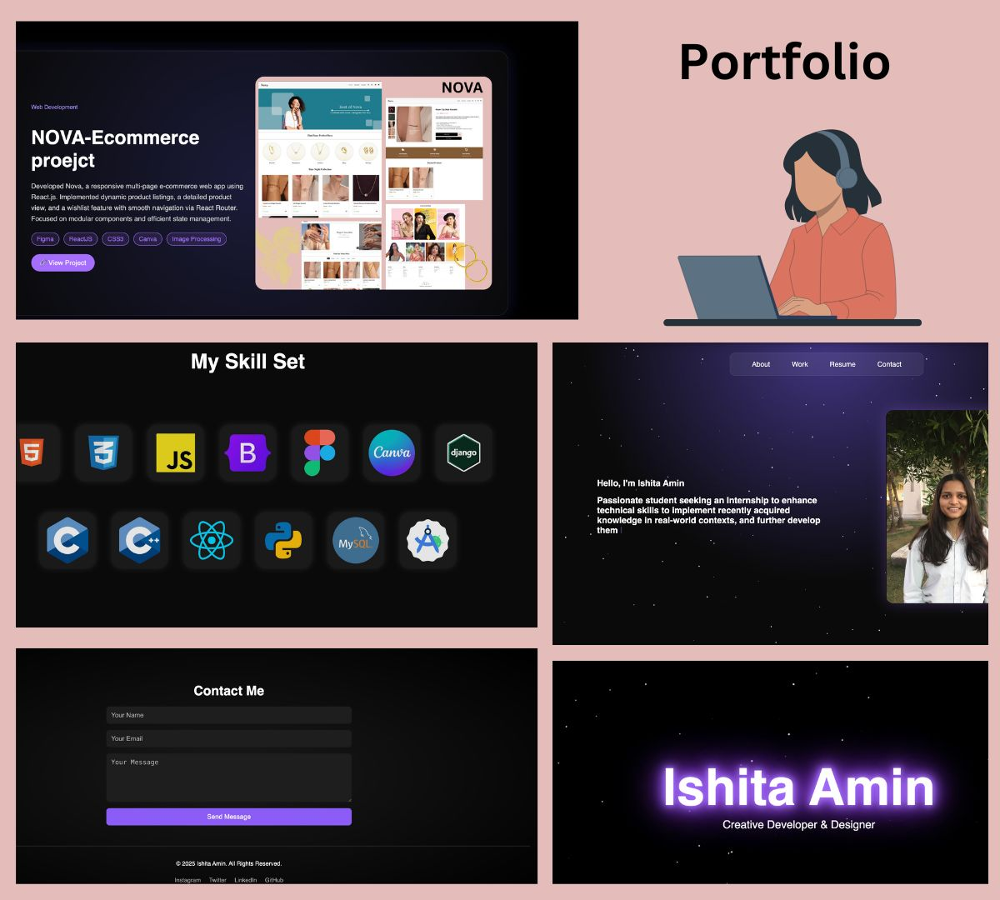

# 🌐 Personal Portfolio – Ishita Amin

This is my **personal developer portfolio website** built using HTML, CSS, and JavaScript. It highlights my work, projects, resume, skills, and contact details — designed to reflect both aesthetics and functionality.

🔗 **Live Website**: [ishitaamin.vercel.app](https://ishitaamin.vercel.app) *(update with your actual domain if different)*

---

## 🛠️ Tech Stack

- **HTML5**
- **CSS3** (Flexbox & Media Queries)
- **Vanilla JavaScript**


---

## ✨ Features

- 🎨 Fully responsive design – works across all devices
- 🧠 Smooth scroll and section-based layout
- 💼 Projects section with external links and GitHub integration
- 📄 Resume download button or view online (optional)
- 📬 Contact form (connected or placeholder)
- 🌙 Optional dark/light theme toggle (if added)
- ✨ Clean UI with animations and interactivity

---

## 🖼️ Preview

> *(Add screenshots here if you want, e.g., full-page view, mobile view, etc.)*




---

## 🚀 How to Run Locally

```bash
git clone https://github.com/ishitaamin/portfolio.git
cd portfolio
open index.html


## 🙋‍♀️ Author

<table>
  <tr>
    <td>
      <strong>Ishita Amin</strong><br/>
      👩‍💻 B.Tech CSE @ Navrachana University<br/>
      📬 <a href="mailto:aminishita30@gmail.com">aminishita30@gmail.com</a><br/>
      🔗 <a href="https://linkedin.com/in/ishitaamin" target="_blank">LinkedIn</a><br/>
    </td>
  </tr>
</table>
